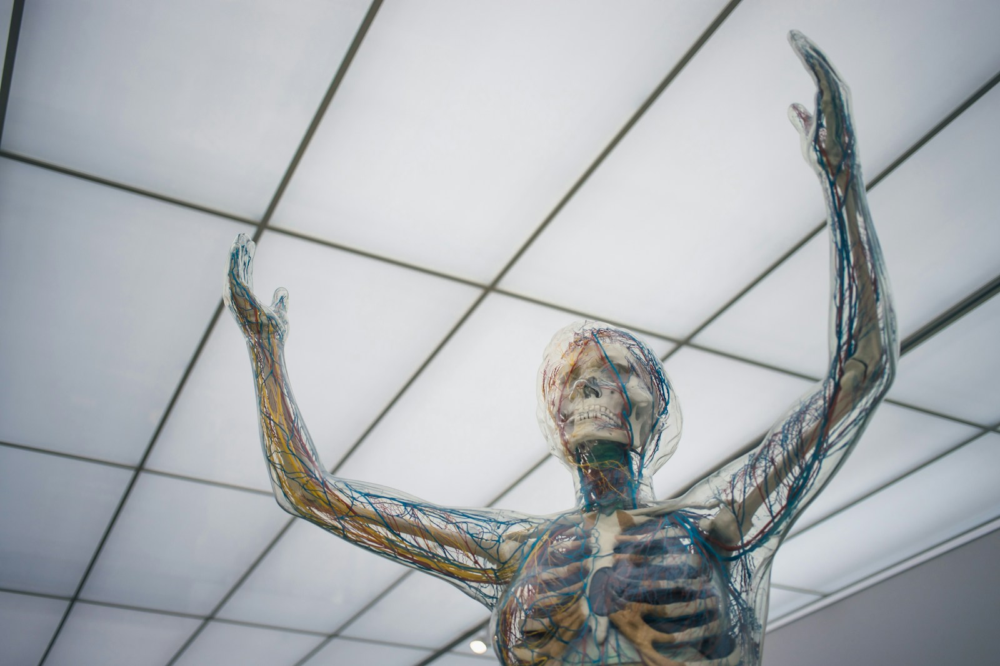

On the spacious mastheads of the second and third masts a band of soldiers could easily manœuvre. Of these six masts, supported by shrouds and metallic back-stays, the second, third, and fourth are made of sheet-iron, and are really masterpieces of ironwork. At the base they measure 43 inches in diameter, and the largest (the main-mast) rises to the height of 207 French feet, which is higher than the towers of Notre Dame.

The workmen were now hurriedly disembarking and clambering up the numerous steps which terminated at the fore-part of the ship. I, with head upturned, and my body thrown back, surveyed the wheels of the 'Great Eastern,' like a tourist looking up at a high edifice.

<Card
  title="This is a link"
  body="Click on this link to visit the link"
  href="https://bbc.co.uk"
/>

At the same time we had reason to hope that these two poor creatures would not see each other again, as the unhappy Ellen never appeared in the daytime, either in the saloons or on the deck. Only at night, perhaps eluding her gaoler, she came out to bathe herself in the damp air, and demand of the wind a smooth passage.

During Monday night the sea was very stormy. Once more the partitions began creaking, and again the luggage made its way through the saloons. When I went on deck, about seven o'clock in the morning, the wind had freshened, and it was raining. The officer on watch had ordered the sails to be taken in, so that the steam-ship, left without any support, rolled dreadfully.

This steam-ship is indeed a masterpiece of naval construction; more than a vessel, it is a floating city, part of the country, detached from English soil, which after having crossed the sea, unites itself to the American Continent. I pictured to myself this enormous bulk borne on the waves, her defiant struggle with the wind, her boldness before the powerless sea, her indifference to the billows, her stability in the midst of that element which tosses 'Warriors' and 'Solferinos' like ship's boats.
